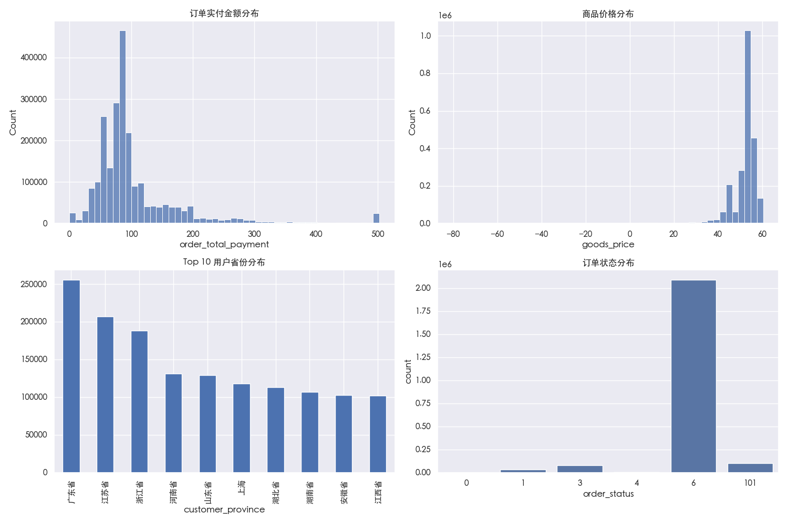
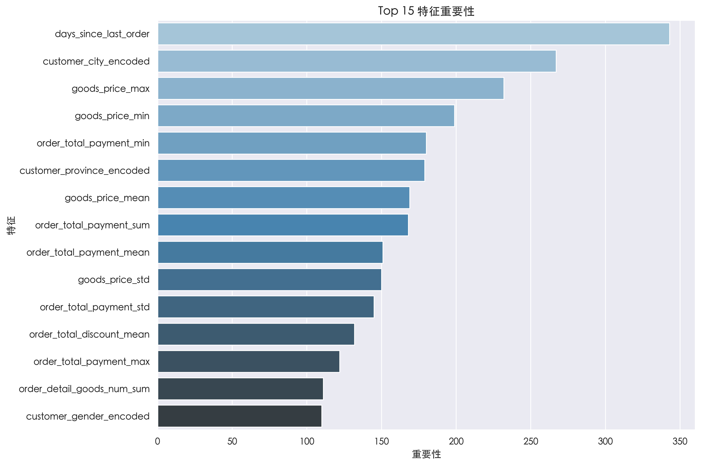
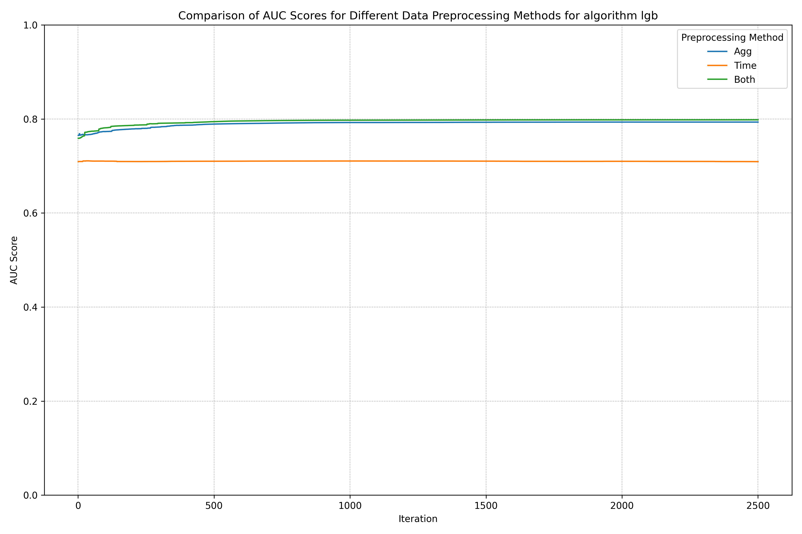
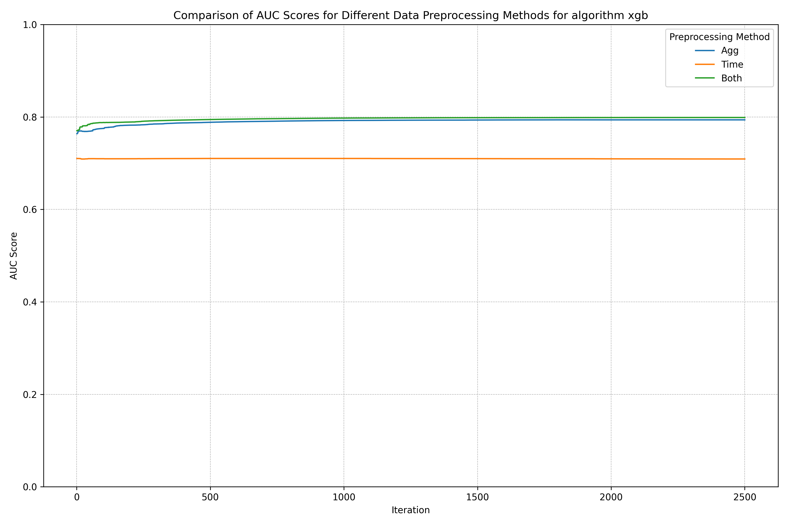
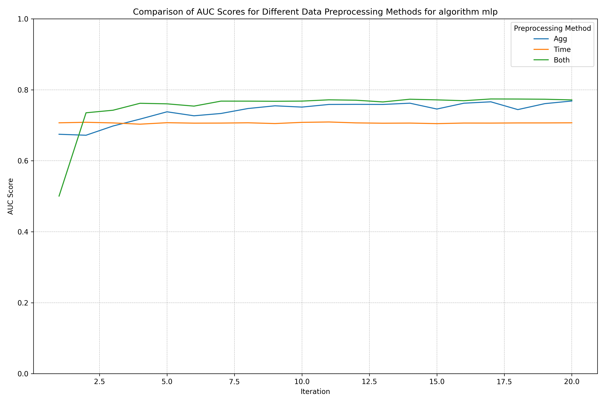
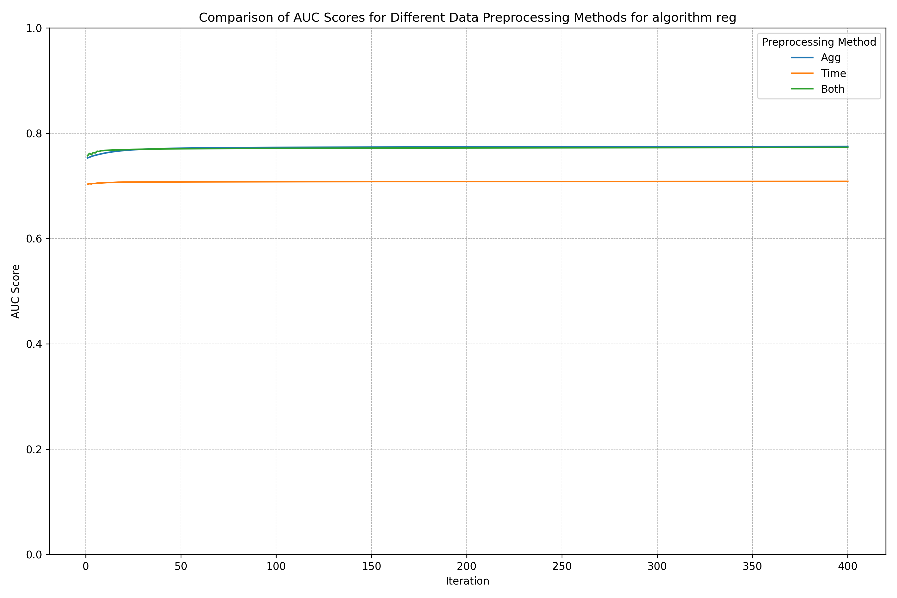
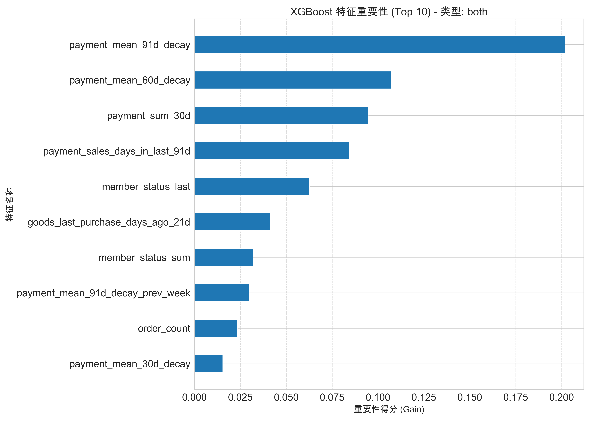
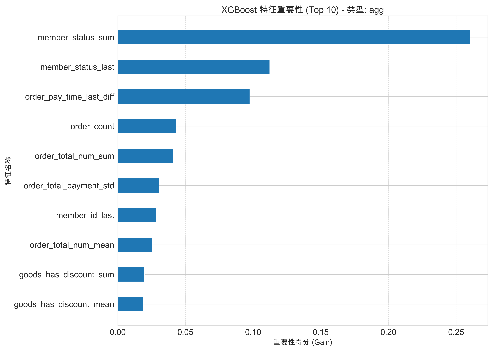
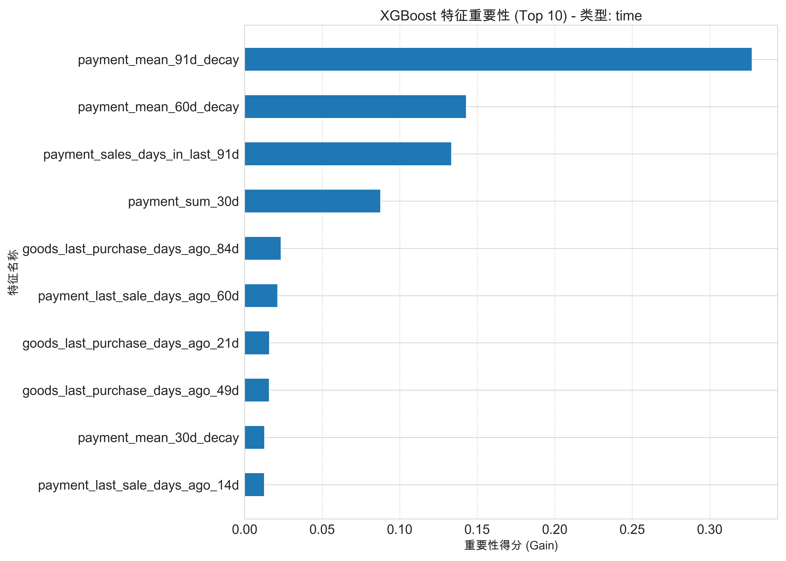

## 2025春数据挖掘课程项目 -- 用户购买预测

组长: 李文爽 组员: 王鹏杰 水晶

### 1. 数据分析与预处理

我们首先观察整个数据集的结构

```
order_detail_id,
order_id,
order_total_num,
order_amount,
order_total_payment,
order_total_discount,
order_pay_time,
order_status,
order_count,
is_customer_rate,
order_detail_status,
order_detail_goods_num,
order_detail_amount,
order_detail_payment,
order_detail_discount,
customer_province,
customer_city,
member_id,
customer_id,
customer_gender,
member_status,
is_member_actived,
goods_id,
goods_class_id,
goods_price,
goods_status,
goods_has_discount,
goods_list_time,
goods_delist_time
```

总体而言, 大致有以下几类实体:

1.  **用户信息**: `customer_id`, `customer_gender`, `customer_province` `customer_city`

2.  **商品信息**: `goods_id`, `goods_status`, `goods_price`, `goods_has_discount`, `goods_list_time`, `goods_delist_time`

3.  **订单信息**: `order_id`, `order_pay_time`, `order_amount`, `order_total_payment`, `order_status`等.

4.  **会员信息**: `member_id`, `member_status`.

#### 1.1 数据总体分析

数据集 `train.csv` 包含 $2,306,871$ 条记录和 $29$ 个字段,涵盖用户信息、商品信息、订单信息和会员信息. 以下是对数据集的详细分析:

1. **数据规模与结构**

   - 数据集包含 $2,306,871$ 条订单详情记录, 涉及 $1,585,986$ 个独特用户(`customer_id`), 表明存在大量重复购买行为.
   - 字段类型包括数值型(`int64`, `float64`)、类别型(`object`)和时间型(`order_pay_time`, `goods_list_time`, `goods_delist_time`), 时间字段以字符串格式存储,需转换为日期格式进行处理.

2. **缺失值分析**

   - 缺失值比例较低,总体数据完整性较好.具体缺失情况如下:
     - `customer_province`:$1,139$ 条缺失($0.049\%$)
     - `customer_city`:$1,150$ 条缺失($0.050\%$)
     - `goods_price`:$436$ 条缺失($0.019\%$)
     - `customer_gender`, `member_status`, `is_member_actived`:各有 $1,671,081$ 条缺失($72.44\%), 表明大部分用户未提供性别信息, 会员相关字段缺失严重, 可能因非会员用户未填写.
   - 缺失值对特征工程有一定影响,尤其是 `customer_gender` 和会员相关字段, 需在后续处理中剔除.

3. **唯一值统计**

   - `order_detail_id`:$2,306,871$ 个唯一值, 与记录数一致, 表明每条记录对应唯一的订单详情.
   - `customer_id`:$1,585,986$ 个唯一值, 反映用户基数庞大.
   - `goods_id` 和 `goods_class_id`:各 1,037 个唯一值, 表明商品种类相对有限.
   - `customer_province` 和 `customer_city`: 分别有 $33$ 和 $375$ 个唯一值, 显示用户地理分布较广.
   - `member_status` 和 `is_member_actived`: 仅 $1$ 个唯一值(均为 $1$), 表明所有记录的会员均为正常且已激活状态, 字段区分度低, 可考虑剔除.

4. **数值型特征分布**:

   - **订单相关**:
     - `order_total_payment`(订单实付金额): 均值 $111.47$, 标准差 $164.41$, 最大值 $98,401.50$, 分布右偏, 少量高额订单显著拉高均值.
     - `order_total_num`(订单商品总数): 均值 $1.68$,最大值 $1,700$,表明大部分订单商品数量较少, 少数订单包含大量商品.
     - `order_total_discount`(订单优惠金额): 均值 $2.06$, 最大值 $1,500$, 优惠金额普遍较低.
   - **商品相关**:
     - `goods_price`(商品价格):均值 $52.20$, 标准差 $6.33$, 范围从 $-79.97$ 到 $92.35$, 存在负值(可能为数据错误或退货记录),需进一步处理.

5. **类别型特征分布**:
   - **用户性别(`customer_gender`)**:
     - $94.99\%$ 未知(0), $2.90\%$ 女性(2), $2.10\%$ 男性(1),性别信息缺失严重,限制其预测能力.
   - **订单状态(`order_status`)**:
     - $90.57\%$ 为交易成功(6), $4.25\%$ 为其他状态(101,可能为退货或取消), $3.46\%$ 为卖家发货(3), $1.50\%$ 为等待付款(1),其余状态占比极低.
     - 交易成功订单占比高,表明数据主要反映已完成交易.
   - **商品状态(`goods_status`)**:
     - $83.66\%$ 在售, $12.76\%$ 在库中, $3.59\%$ 其他,反映大部分商品处于可购买状态.
   - **折扣(`goods_has_discount`)**:
     - $91.39\%$ 不支持折扣, $8.61\%$ 支持,折扣商品占比较低.
   - **在售情况(`goods_status`)**: $83.66\%$ 的商品在售(1), $12.76\%$ 在库中(2), $3.59\%$ 其他状态(0).

6. **可视化分析**:

   - 以下为数据集关键特征的可视化结果(见图 1):
     - **订单实付金额(`order_total_payment`)**:如图 1(a) 所示, 金额分布右偏, 大部分订单金额集中在 $0-200$ 元区间,少数高额订单($>1,000$ 元)需截尾处理以减少异常值影响.
     - **商品价格(`goods_price`)**: 如图 1(b) 所示,价格集中于 $49-55$ 元,存在少量负值(可能为退货或数据错误)和高价商品,需清洗异常值.
     - **用户省份(`customer_province`)**:如图 1(c) 所示,Top 10 省份分布显示用户主要集中于特定地区,可能反映平台的主要市场区域.
     - **订单状态(`order_status`)**:如图 1(d) 所示,交易成功(6)占主导,反映数据集以有效订单为主.

   **图 1:数据集关键特征分布**
   

   - 图 1 展示了订单金额、商品价格、用户省份和订单状态的分布,揭示了数据集中用户消费行为集中于低金额订单,商品价格较为稳定,地理分布不均,且交易成功订单占主导.

#### 1.2 不同特征的重要性

为了评估特征对预测用户未来购买行为的重要性,我们先基于静态聚合特征构建了用户画像,并使用LightGBM模型进行简单的训练,以下是特征重要性分析的结果:

1. **特征工程概述**:

   - **静态聚合特征**:按 `customer_id` 聚合订单和商品相关信息,包括:
     - 订单金额(`order_total_payment`):均值、总和、最小值、最大值、标准差.
     - 订单商品数量(`order_total_num`):均值、总和.
     - 订单折扣(`order_total_discount`):均值、总和.
     - 商品价格(`goods_price`):均值、最小值、最大值、标准差.
     - 订单总数(`order_count`):总和.
     - 地理信息(`customer_province`, `customer_city`):标签编码.
     - 时间特征:最后一次订单距 2013-06-30 的天数(`days_since_last_order`).
   - **标签构建**:若用户在 2013-07-01 至 2013-07-31 有购买记录,标签为 1,否则为 0.
   - **数据集划分**:训练集基于 `order_pay_time <= 2013-06-30`(1,354,575 条记录),验证集基于 `order_pay_time <= 2013-07-31`(1,434,115 条记录),特征缺失值填充为 -999.

2. **特征重要性排名**(Top 15,基于特征分裂增益,见图 2):

   - **days_since_last_order**(343):最后一次订单距 2013-06-30 的天数,排名第一,表明用户近期活跃度对预测至关重要.
   - **customer_city_encoded**(267):城市编码,地理位置对购买行为有显著影响,可能反映区域消费差异.
   - **goods_price_max**(232):最高商品价格,反映用户高端消费能力.
   - **goods_price_min**(199):最低商品价格,可能捕捉用户对低价商品的偏好.
   - **order_total_payment_min**(180):最低订单实付金额,反映用户最小消费行为.
   - **customer_province_encoded**(179):省份编码,地理信息的重要性次于城市.
   - **goods_price_mean**(169):商品平均价格,反映用户偏好的商品价位.
   - **order_total_payment_sum**(168):订单实付总金额,反映用户历史消费强度.
   - **order_total_payment_mean**(151):订单平均实付金额,反映用户消费能力.
   - **goods_price_std**(150):商品价格标准差,反映用户购买价格的波动性.
   - **order_total_payment_std**(145):订单实付金额标准差,反映消费金额的稳定性.
   - **order_total_discount_mean**(132):平均订单优惠金额,反映用户对折扣的敏感度.
   - **order_total_payment_max**(122):最高订单实付金额,反映用户单次最大消费能力.
   - **order_detail_goods_num_sum**(111):订单商品总数,反映用户购买的累计规模.
   - **customer_gender_encoded**(110):性别编码,尽管数据缺失严重,仍有一定预测价值.

   **图 2:特征重要性排名(Top 15)**
   

   - 图 2 展示了 Top 15 特征的重要性,`days_since_last_order` 和地理信息(如 `customer_city_encoded`)占据主导,消费行为和商品价格相关特征也有显著贡献.

3. **分析与洞察**:
   - **时间特征主导**:`days_since_last_order` 排名第一,表明用户近期活跃度是预测未来购买的核心指标,近期购买的用户更可能复购.
   - **地理信息重要**:`customer_city_encoded` 和 `customer_province_encoded` 排名靠前,表明地理位置对购买行为有显著影响,可能与区域经济水平或消费习惯相关.
   - **消费行为特征**:订单金额(均值、总和等)和商品价格(最大值、最小值等)的重要性较高,反映用户消费能力、购买偏好和价格敏感度是关键预测因子.
   - **折扣敏感性**:`order_total_discount_mean` 排名靠前,表明优惠对部分用户的购买决策有影响.
   - **性别特征潜力**:`customer_gender_encoded` 尽管数据缺失严重(72.44%),仍显示一定重要性,填补缺失值可能提升其预测能力.

### 2. 特征工程 与 训练集验证集划分

项目的核心任务是预测`customer_id`在未来是否会产生购买行为. 因此, 我们的特征工程将围绕`customer_id`进行, 聚合每个用户的历史行为信息, 以刻画其消费习惯、兴趣偏好和活跃程度.

为了从原始数据中提取有效信息,我们设计并实施了一套复杂的特征工程流水线. 总体思路是:首先, 对数据进行时序切分, 以确保训练和验证的合理性, 防止未来信息泄露; 其次, 从 "静态聚合" 和 "动态时序" 两个维度构建特征; 最后, 对生成的数据集进行编码和填充, 使其适用于机器学习模型.

首先, 我们可以假设用户的长期习惯和总体特征是决定其未来行为的关键, 从而为每个用户创建一个**静态但全面**的个人档案. 我们从以下几个特征大类出发, 试图回答这样的问题: "这位用户总的来说是一位怎样的顾客?". 是一位高价值用户, 还是一位价格敏感型用户, 还是一位冲动型消费者?

另一方面, 我们还可以将用户行为视作一个连续的时间序列, 通过捕捉近期的行为趋势去进行预测下个月的行为. 我们希望借助这些特征去捕捉, "这位用户最近在做什么?", "他的消费是正在升温还是正在冷却?", "他的购买行为是持续性的还是脉冲式的?", 这些时序上的模式.

我们采用了两种互补的特征工程方法,由`config.data.feature_method`参数控制:

1.  **静态聚合特征 (`agg`)**: 该方法将每个用户在特定时间点之前的所有历史行为数据进行聚合,生成一组描述用户整体画像的统计特征.

2.  **动态时序特征 (`time`)**: 该方法将用户的购买和支付行为看作时间序列,通过在不同长度的时间窗口上进行滑窗统计,捕捉用户近期行为的动态变化趋势.

#### 2.1. 静态聚合特征

静态特征主要由`preprocess_agg`函数实现, 为每个`customer_id`生成一个截至某个时间点的全局行为表征. 具体构建的特征如下:

1.  **最后一次行为特征**: 提取用户最后一次交互的各类信息:
    - 最后购买的商品信息 (`goods_id_last`, `goods_price_last`等).
    - 最后一笔订单的详情 (`order_amount_last`, `order_pay_time_last`等).
    - 最后的会员状态 (`member_status_last`等).
    这些特征能直接反映用户的最近一次行为状态.

2.  **聚合特征**: 对能够反映用户行为程度的数值型特征:
    - 对商品价格 (`goods_price`) 计算其最小值, 最大值, 均值和标准差.
    - 对订单支付金额 (`order_total_payment`) 计算其最小值、最大值、均值和标准差.
    - 对订单商品总数 (`order_total_num`)、订单折扣 (`order_detail_discount`) 等计算均值和总和.

3.  **计数类特征**:
    - `order_count`: 用户历史总订单数.
    - `goods_count`: 用户历史总购买商品件数.

4.  **其他聚合特征**:
    - `discount`: 通过 `order_detail_amount_last / order_detail_payment_last` 计算用户最近一次购买的折扣力度.
    - **时间处理**:
        - 将最后支付时间 `order_pay_time_last` 分解为月、日、星期几等多个维度, 捕捉时间偏好.
        - 计算最后支付时间、商品上架/下架时间与一个固定历史时间点(`2012-10-11`)之间的天数差(`_diff`),将绝对时间转化为相对时间间隔,消除时间戳的量纲影响.
        - 计算商品从上架到下架的持续时间 `goods_time_diff`.

5.  **空值与无穷值处理**: 在完成特征计算后, 将计算过程中可能产生的无穷值替换为`NaN`, 随后统一使用 $-999$ 填充所有`NaN`值.

#### 2.2. 动态时序特征

为了更精细地捕捉用户行为的时序动态性,我们设计了`generate_timeseries_features`函数,通过**滑动窗口法**构建了一系列时序特征.

1.  **支付行为时间序列特征**:
    - **时间窗口**: 选取了14天、30天、60天、91天作为滑窗长度.
    - **衰减加权统计**: 计算了窗口内每日支付额的**衰减加权均值** (`payment_mean_{T}d_decay`),衰减系数为0.9.这种方法使得越近的消费行为权重越高,更能反映用户近期的消费状态.
    - **常规统计**: 计算了窗口内的支付总额 (`_sum`) 和最大单日支付 (`_max`).
    - **行为频率特征**:
        * `payment_sales_days_in_last_{T}d`: 窗口内产生消费的天数.
        * `payment_last_sale_days_ago_{T}d`: 距离窗口期末,最近一次消费是多少天前.
        * `payment_first_sale_days_ago_{T}d`: 距离窗口期末,第一次消费是多少天前.
    - **跨周期比较**: 计算了当前窗口与上一周同一窗口的统计量 (`_prev_week`),用于捕捉消费变化的趋势(环比增长/下降).
    - **月度聚合**: 聚合了过去3个月(每30天为一个周期)的消费总额.

2.  **购买商品数量时间序列特征**:
    - **时间窗口**: 选取了21天、49天、84天(以7天为基本单位)作为滑窗长度.
    - **特征类别**: 与支付行为特征类似,计算了窗口内的购买商品总数、均值、最大值 (`_sum`, `_mean`, `_max`),购买天数 (`_purchase_days_in_last`),以及最近/最远购买日期间隔等.
    - **近似月度聚合**: 聚合了过去3个周期(每28天为一个周期)的购买商品总数.

这些时序特征从多个粒度(不同长度的时间窗)和多个角度(金额、数量、频率、周期性)全面地刻画了用户的近期购买行为模式.

#### 2.3. Label构建

预测任务是判断用户在未来一个月内是否会购买.在`create_feature_set`函数中,目标变量`label`的构建逻辑如下:

对于给定的特征时间截止点 `feature_end_date`, 我们考察其后的一个月(从 `feature_end_date + 1 day` 开始的一个月)内. 如果用户在此期间有任何购买记录, 则其`label`为1,否则为0.

$$
\text{label}_i = 
\begin{cases} 
    1, & \text{if customer } i \text{ made a purchase in } (T, T + 1\text{ month}] \\
    0, & \text{otherwise} 
\end{cases}
$$

#### 2.4. 数据集划分与最终处理

为了模拟真实的预测场景并防止数据泄露, 我们采用了基于时间的滚动窗口来切分数据集, 具体由主函数`preprocess`控制. 这种划分方式确保了模型的验证是在一个比训练更晚的时间段上进行的, 其评估结果能更好地反映模型在未来数据上的表现.

1.  **训练集**:
    - **特征区间**: `order_pay_time` <= `2013-06-30`
    - **标签区间**: `2013-07-01` 至 `2013-07-31`

2.  **验证集**:
    - **特征区间**: `order_pay_time` <= `2013-07-31`
    - **标签区间**: `2013-08-01` 至 `2013-08-31`

3.  **测试集**:
    - **特征区间**: `order_pay_time` <= `2013-08-31`
    - **标签区间**: 无(用于线上预测)

在生成三个数据集后,我们进行了最后的**类别特征编码**: 对`customer_province`和`customer_city`这类类别型特征, 使用`sklearn.preprocessing.LabelEncoder`进行标签编码. 为了保证编码的一致性,编码器在训练集上进行`fit`, 然后统一`transform`到验证集和测试集. 对于在训练集中未出现的新城市/省份, 通过`map`的方式处理并填充为-1.

### 3. 算法实现

#### 3.1.总体框架

为了便于管理和比较不同模型, 我们设计了一套统一的、可扩展的算法框架.

1.  **模型基类 (`model.py`)**: 我们定义了基类`BaseModel`, 规范了所有模型类必须的`train`和`predict`两个接口.

2.  **训练与预测脚本 (`train.py`)**: 这是项目的总控制脚本,负责执行模型的训练和预测任务.
    - **配置管理**: 使用`Hydra`库来管理所有配置, 包括数据路径、特征方法、模型名称及各自的超参数. 这使得实验配置清晰、可复现.
    - **模型工厂**: `get_model`函数作为工厂, 根据配置文件中的`model_name`(如 "lgb", "xgb", "mlp")实例化对应的模型对象, 并传入相应的超参数.
    - **训练流程**: `train`函数负责加载预处理好的训练集和验证集, 调用所选模型的`train()`函数, 并传入训练数据、验证数据以及评估指标.
    - **预测流程**: `predict`函数负责加载训练好的模型和测试集, 调用模型的`predict()`函数生成预测概率, 并生成最终的提交文件.

#### 3.2. 模型实现详情

我们共实现了四种不同的模型,涵盖了从传统统计模型到集成学习和深度学习的方法.

1. 回归模型 (**手动实现**)

逻辑回归是一个经典的线性分类模型.为了更好地理解其底层原理,我们从零开始使用`Numpy`实现了一个逻辑回归模型(`model_reg.py`).

- **网络结构**:
    - **梯度下降**: `fit`方法计算当前权重下的预测值与真实标签之间的误差, 梯度下降算法来优化模型权重. 权重更新公式为: $W_{new} = W_{old} - \alpha \frac{1}{m} X^T(\sigma(XW) - y)$.

- **模型封装 (`RegModel`)**:
    - **特征预处理(标准化)**: 在训练前, `preprocess`方法对输入特征进行**标准化**, 并记录训练集的均值和标准差, 以便在预测时对测试集应用相同的变换.
    - **接口统一**: 封装了`RegNet`.

2. XGBoost

- **模型封装**: `XGBModel`类是对`xgboost`库中`XGBClassifier`的封装.

- **超参数配置**: 模型的关键超参数, 如树的最大深度 (`max_depth`)、学习率 (`lr`)、迭代次数 (`num_epochs`)、列采样率 (`colsample_bytree`)、L1/L2正则化系数 (`reg_alpha`, `reg_lambda`) 等,都通过 `Hydra` 配置文件传入.

- **训练与评估**: `train`方法直接调用`XGBClassifier`的`.fit()`方法, 接受验证集 (`eval_set`), 监控验证集上的性能指标, 方便地进行模型调优和早停判断.

- **模型保存**: 训练完成后, 模型被保存为 `.json` 文件, 以便在预测阶段直接加载使用.

3. LightGBM

- **模型封装**: 对`lightgbm`库中的`LGBMClassifier`封装.

- **超参数配置**: 同样, 模型的超参数如叶子节点数 (`num_leaves`)、学习率 (`lr`)、最大深度 (`max_depth`) 等, 均由外部配置传入. 参数配置与XGB相同.

- **训练与评估**: 训练流程与 XGBoost 类似, 调用`.fit()`方法并传入验证集进行监控.利用LightGBM 的`lgb.log_evaluation`实现训练日志输出.

- **模型保存**: 训练好的模型通过`joblib`库进行序列化, 保存为 `.joblib` 文件.

4. 多层感知机 (Multi-Layer Perceptron)**

为了捕捉非线性特征交互, 我们使用`PyTorch`构建了一个MLP模型.

- **网络结构**:
    - `MLPNet`类定义了一个灵活的神经网络结构.
    - 网络由多个可配置的隐藏层组成,每个隐藏层是一个"Linear + BN + ReLU + Dropout"的模块.
    - 采用kaiming初始化.

- **模型封装 (`MLPModel`):
    - **优化器与损失函数**: 使用`Adam`作为优化器. 针对本项目的二分类任务, 选择了`BCEWithLogitsLoss`作为损失函数(数值稳定性好一些).
    - **训练循环**: 数据被`DataLoader`分批加载. 每个 epoch 中, 模型遍历所有批次的数据, 周期性地在验证集上进行评估, 打印性能指标.
    - **模型保存**: 权重被保存为 `.pth` 文件.

### 4. 结果分析

现在我们对前述特征工程方案和算法模型的有效性进行定量评估和分析. 我们以**AUC**作为核心评估指标, 因为它能综合衡量模型在所有分类阈值下的能力, 对于不平衡分类问题尤为关键. 我们将从特征工程和算法模型两个角度展开讨论.

为了探究不同特征构建策略对模型性能的影响, 我们设计了三套特征工程方案: **`agg`**(静态聚合特征)、**`time`** (动态时序特征) 和 **`both`**(两者结合). 我们在 MLP, Reg, XGB 和 LGB 三个模型上分别测试了这三套特征集的效果.

#### 4.1. 结果









#### 4.2. 特征工程影响

综合三张图表, 我们可以观察到高度一致且清晰的规律:

1.  **性能**: 在XGB, LGB, MLP模型上, 特征集的表现排序均为: **`both` > `agg` >> `time`**. `Both` 特征集取得了最佳性能, `Agg` 紧随其后且差距微小, 而 `Time` 特征集的表现则远逊于前两者. 而在Reg模型上, 后期表现 **`agg` > `both`**, 差距虽然小($0.775$和$0.773$)但不可忽视.

2.  **收敛**:
    - 使用 `time` 特征集时, 所有模型的学习曲线都表现为一条近乎水平的直线.AUC值从一开始就处于一个较低的水平, 并且在整个训练迭代过程中几乎没有任何提升.
    - 使用 `agg` 和 `both` 特征集时, 模型表现出健康的学习趋势. AUC值在训练的早期阶段(约前20%的迭代次数内)快速上升, 随后趋于平稳.

从这些现象出发, 我们可以讨论特征工程的影响:

1. **为什么 `time` 特征效果不佳？**
    `time` 主要刻画了用户行为的时序(尤其是近期)特征, 只描述了行为模式, 但缺乏行为的主体信息. 模型仅凭这些信息, 难以了解用户固有属性的静态画像, 无法建立起有效的用户认知, 导致其预测能力非常有限. **学习曲线的平直**也印证了这一点: 模型在最初的几次迭代中就已从这种单一维度信息中学会了了所有能学到的知识, 后续迭代无法再发现新的有效模式.
    
    同时时序特征非常**稀疏**, **噪音**极大. 因为对于大多数非核心用户, 他们在很多天内是没有消费的. 这会导致时序矩阵非常稀疏, 很多基于近期窗口计算有很多噪音.

    此外, 这种方法产生了大量高度相关的特征(例如 `payment_mean_14d` 和 `payment_mean_30d`), 模型可能过度关注近期的微小波动, 导致泛化能力下降.

2. **为什么 `agg` 特征有稳健表现?**
    `agg` 构建的是一个用户的**长期、稳定的画像**. 它通过聚合用户全部历史行为, 捕捉了用户的长期习惯, 不容易被短期的异常行为所干扰. 对于预测“是否购买”这种相对宏观的行为, 长期习惯往往是更决定性的因素. 因此, 仅使用 Agg 特征集就能让模型的AUC值达到一个很高的水平(接近0.8), 证明了建立用户静态画像是本次预测任务的核心与基石.

3. **为什么 `both` 特征能取得最佳效果?**
    `Both` 特征集将 `Agg` 和 `Time` 进行了结合, 融合了两个维度的信息:`Agg` 特征提供了长期静态画像,`Time` 特征则在此基础上, 补充了近期行为趋势动态趋势.

    通过结合,模型可以做出更精细化的判断. 例如, 面对两个历史画像 (`Agg`特征) 相似的用户, 模型可以利用`Time`特征进一步区分: 一个用户近期购买频率和金额都在上升(强购买信号), 而另一个则长期沉寂(流失风险高). 这使得模型既能把握用户的本质, 又能捕捉其状态的边际变化, 从而在 `Agg` 的高基础上实现微小但稳定的性能提升, 最终获得最佳的预测效果.

4. **为什么对`reg`模型, `agg`比`reg`表现更好?**
    这种现象很可能是由于**噪声**特征的引入所导致的. 树模型在构建每棵树时会进行特征选择, 如果一个特征没有带来信息增益, 它就不会被用于分裂节点. 而逻辑回归则必须为每一个输入特征分配一个权重. 当我们从 `agg` 转换到 `both` 时, 我们增加了一倍动态时序特征. 由于这些新增特征包含了较多的噪声, 损害到从 `agg` 特征中学到的、更强大、更稳定的模式. 这可以被视为一种轻微的**过拟合**.

    至于训练初期 `both` 效果稍好, 但后期被 `agg` 反超, 可以这样理解: 训练初期, `time` 特征提供的新信息确实带来了一些快速的、表面的性能提升. 但随着训练的进行, 模型在更强大的 `agg` 特征上学习得越来越充分, 而 `time` 特征带来的噪声和过拟合负面效应逐渐显现并累积, 最终导致 `both` 的性能上限被锁定在一个略低于纯 `agg` 特征集的水平.

#### 4.3. 算法影响

四种算法的性能形成了两个明显的梯队:
    - **树模型**: XGBoost 和 LightGBM表现非常接近, AUC值均在 $0.798$ 左右, 其中 XGBoost 以非常微弱的优势(约$0.0008$)领先.
    - **MLP和Reg**: 逻辑回归和 MLP.两者表现也较为接近,AUC值在 $0.77$ 左右, 其中逻辑回归以小优势(约$0.002$)领先.

从这些现象出发, 我们可以讨论不同算法的影响:

1. **为什么梯度提升树(XGB/LGB)表现最佳？**
    XGBoost 和 LightGBM 都属于**GBDT**算法.这类算法在处理我们这样的表格类数据时, 具有天然的优势:
    
    - **非线性建模**: 树模型通过不断地切分特征空间, 可以自动地、高效地捕获特征之间的高阶、非线性交互关系.
    - **特征利用**: 树模型对特征的缩放不敏感, 能自然地处理数值型特征, 且能够自然处理序数型特征.
    - **鲁棒性强**: 对异常值不敏感, 且集成学习的本质使其具有很高的预测稳定性和准确性.
    
    XGB 和 LGB 作为 GBDT 的两大代表性实现, 性能相近是意料之中. 它们之间的微小差异可能源于树的**生长策略**(XGB是层序生长,LGB是叶序生长)以及具体超参数设置下的细微不同(因为不一定调为最优).

2. **为什么 MLP 和 Reg 表现稍逊？**
    - **Reg**: 作为一个**线性模型**, Reg难以捕捉非线性关系, 其线性假设的本质限制了它性能的上限. 它能取得约 $0.773$ 的AUC, 说明特征集中存在很强的线性可分性, 但它无法企及树模型的高度.
    
    - **MLP**: **理论上**, MLP可以逼近任意复杂函数. 然而,在有限的的表格数据上, 它不敌GBDT. 原因可能在于landscape通常很复杂, 优化和调参难度较大,对超参数更敏感. 另一方面, 我们的特征工程要求模型进行特征交互, MLP这方面的效果在表格数据上有如树模型特征切分来得直接和有效. 此外, 深度学习模型通常需要极大规模的数据才能充分发挥其潜力, 而我们的数据集不是很大, 并且相对稀疏, 这也给MLP带来了很大困难.
    
    并且在本实验中, MLP甚至微弱地输给了结构更简单的逻辑回归. 这可能表明, 对于当前特征集,复杂的非线性组合并未带来收益.

#### 4.4 不同特征的影响

我们将不同特征的权重可视化之后得到后面的图. 从中我们可以看出:

1. 近期消费行为是最强的信号

用户近期支付行为相关的特征, 尤其是带时间衰减的加权平均值(payment_mean_91d_decay), 占据了极高的重要性. 这说明一个用户最近两三个月的消费活跃度是判断其未来是否会购买的头号指标。

2. 用户身份与状态占据稳固而可靠的地位

这是因为用户的静态、长期属性，特别是会员状态(`member_status_last`, `member_status_sum`)和历史购买总数(`order_count`), 是模型做出稳健判断的基石. 它们定义了用户最核心、稳固的特征.

3. 我们还观察到一个奇怪的现象, 虽然`agg`和`both`性能接近, 但是`both`中重要性高的指标却是`time`中的.

我们可以这样理解, 如果两个用户的`agg`特征几乎一样, 那么模型会很难区分他们, 可能会给出相似的、较高的购买预测概率. 这时候就需要利用`time` 特征, 它提供了决定性的证据. 也就是说对于 `both` 模型来说, `payment_mean_91d_decay` 这个特征就成为了区分这两个用户的**最强信号**. 它能够以极高的信息增益将这群模棱两可的用户清晰地划分为"近期活跃=>会买"和"近期沉寂=>不会买"两个群体。

因为 `agg` 已经完成了绝大部分预测任务，`time` 特征只是在 `agg` 的基础上进行“精修”和“纠错”，提升的是模型处理疑难案例的能力，所以体现在**总AUC上的增幅不大**.

但是`time`解决了`agg`无法解决的最关键问题, 在最需要区分的地方提供了信息量, 所以模型给予的**权重最大**.





#### 4.5. 结论

1. **特征工程层面**: **静态聚合 + 动态时序** 的特征工程策略是预测用户购买行为的最优解.

2. **算法层面**: **GBDT(XGBoost/LightGBM)** 是处理此类表格数据预测任务的最佳选择, 其强大的非线性建模能力和鲁棒性使其显著优于线性和神经网络模型.